# Ansible

Ansible is an open-source IT automation tool that simplifies the management of systems and applications. It allows you to automate tasks like configuration management, application deployment, and orchestration of complex workflows across multiple machines. Ansible is widely known for being:

- **Agentless**: It doesn’t require any software agents to be installed on the systems it manages, reducing setup and maintenance complexity.

- **Simple and YAML-Based**: Ansible uses human-readable YAML files called "Playbooks" to define automation tasks, making it user-friendly for both developers and system administrators.

- **Efficient**: It connects to systems using SSH or WinRM (Windows Remote Management) and executes commands directly, making it lightweight and efficient.

- **Scalable**: You can manage a small number of servers or scale up to handle thousands of systems with ease.

Ansible is particularly popular for use cases like provisioning servers, managing cloud infrastructure, configuring networks, and deploying applications.

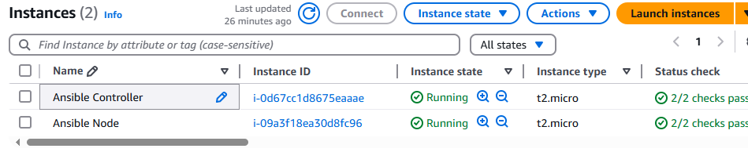

Provisioning and configuration in one step is called templating

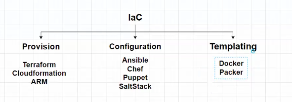

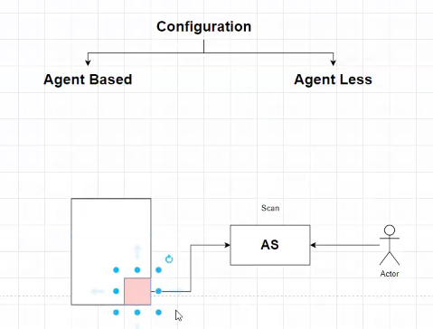

Ansible vocabulary we call the machines that we handle is called NODE

Where we install Ansible is called "Ansible Controller"

Ansible is developed using Python

All that we need to execute a set of commands

https://docs.ansible.com/ansible/latest/installation_guide/installation_distros.html

- sudo apt update
- sudo apt install software-properties-common
- sudo add-apt-repository --yes --update ppa:ansible/ansible
- sudo apt install ansible

Ubuntu by defalt has python.

https://docs.ansible.com/ansible/latest/inventory_guide/intro_inventory.html

Assignment

This is the default location of the ansible confioguration file sudo nano /etc/ansible/ansible.cfg

**Ansible Controller**

- ansible --version
https://github.com/ansible/ansible/blob/stable-2.9/examples/ansible.cfg

- python3 --version (Python is installed by default in ubuntu)
- mkdir ansible-controller
- cd ansible-controller
- nano ansible.cfg
    [defaults]
    inventory = ./dev

- sudo nano dev 
- This file contains the inventory information like **IP address, ansible_user,ansible_password,ansible_ssh_private_key_file etc**
  Add the IP addresses of the node that you wan't to connect
  If the username is not provided explicilty then Ansible will use the current user.

3.142.96.200 ansible_user=ubuntu ansible_ssh_private_key_file=key1.pem
18.117.134.30 ansible_user=ec2-user ansible_ssh_private_key_file=key2.pem

3.145.40.86
3.135.188.217

- sudo nano key.pem
- chmod 400 key.pem
- sudo ansible -m ping all
- ssh-keygen

- cat /home/ubuntu/.ssh/id_ed25519.pub
ssh-ed25519 AAAAC3NzaC1lZDI1NTE5AAAAIJ45z/6xA/3VFkP9suCPMK4iRx88y+kk2TR5NadYkjSL ubuntu@ip-172-31-42-45

**Ansible Node**
- python3 --version
- sudo nano .ssh/authorize_keys

**Ansible Controller**
- Now from the dev file removed the remaining parameters and leave the IP address alone and you should be able to connect.
- Connect to the node
- sudo ssh ubuntu@3.19.76.162

sudo ssh ubuntu@18.221.208.64 
sudo ssh ec2-user@18.117.134.30

ssh -v root@3.16.214.209

Ansible Ubuntu Controller 3.147.42.88
Ansible Ubuntu Node       18.216.244.164
Ansible Amazon Linux Node 18.220.227.123

mkdir playbooks
sudo nano playbooks/install-apache.yml

---
- hosts: all
  become: true
  tasks:
   - name: Install apache
     apt: name=apache2 state=present

   - name: Start Apache
     service: name=apache2 state=started

---
- hosts: all
  become: true
  tasks:
   - name: Install apache
     apt: name=apache2 state=present
     tags: install

   - name: Start Apache
     service: name=apache2 state=started
     tags: config

install-apache.yml

sudo ansible-playbook playbooks/install-apache.yml

dry run of the playbook

sudo ansible-playbook playbooks/install-apache.yml --check

sudo ansible-playbook playbooks/install-apache.yml --start-at-task "Start Apache"

sudo ansible-playbook playbooks/install-apache.yml --tags "install"

sudo ansible-playbook playbooks/install-apache.yml --skip-tags "install"

if the above command doesn't work use the below
ansible-playbook -i dev playbooks/install-apache.yml

[webserver]
18.221.208.64 ansible_user=ubuntu ansible_ssh_private_key_file=key1.pem
1.1.1.1
2.2.2.2
3.3.3.3

[db]
18.117.134.30 ansible_user=ec2-user ansible_ssh_private_key_file=key2.pem
4.4.4.4
5.5.5.5

sudo nano playbooks.shell-demo.yml

---
- hosts: webserver
  become: true
  tasks:
    - name: create a dir
      shell: mkdir test

sudo ansible-playbook playbooks/shell-demo.yml

vi pl

sudo nano playbooks/command-demo.yml

---
- hosts: webserver
  tasks:
   - command: abc

sudo ansible-playbook playbooks/command-demo.yml

sudo nano playbook/index.html

<html>
<head></head>
<body><h1>Welcome to Ansible</h1></body>
<html>

sudo nano playbooks/copy-demo.yml

---
- hosts: webserver
  become: true
  tasks:
    - name: Deploy Application
      copy: 
        src: index.html 
        dest: /var/www/html/

sudo ansible-playbook playbooks/copy-demo.yml

http://18.221.208.64/

cd /etc/apache2 

cat ports.conf

sudo nano playbooks/lineinfile-demo.yml

---
- hosts: webserver
  become: true
  tasks:
    - name: Update apache port
      lineinfile: 
        path: /etc/apache2/ports.conf
        regexp: "^listen 80"
        line: "Listen 90"
    
    - name: Restart Apache
      service: name=apache2 state=restarted

sudo ansible-playbook playbooks/lineinfile-demo.yml

cp playbooks/lininfile-demo.yml playbooks/handlers-demo.yml

---
- hosts: webserver
  become: true
  tasks:
    - name: Update apache port
      lineinfile:
        path: /etc/apache2/ports.conf
        regexp: "^listen 80"
        line: "Listen 90"
      notify: Restart Apache

  handlers:
    - name: Restart Apache
      service: name=apache2 state=restarted

    Handlers will only get executed only ones.

https://www.redhat.com/en/services/certification/rhcs-ansible-automation

https://www.redhat.com/en/services/training/ex294-red-hat-certified-engineer-rhce-exam-red-hat-enterprise-linux-9

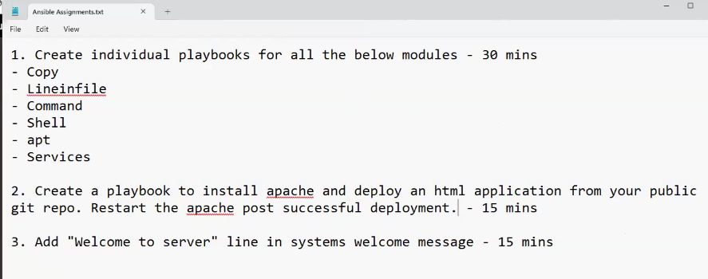

We will be using variable to make playbooks configurable

---
- hosts: web1
  become: true
  vars:
    pkg_name: nano
  tasks:
    - name: Install {{ pkg_name }}
      apt: name= "{{ pkg_name }}" state=present

The variables are available defined in the playbook will be availble in the context of all the nodes that the playbook targets

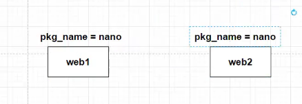

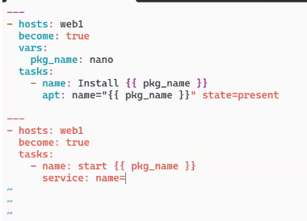

2 differnt playbooks defined in a single file

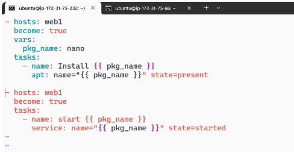

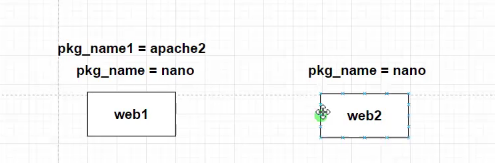

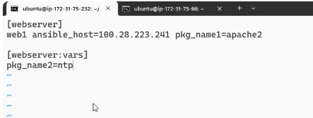

Run Time variables can also be passed.

ansible-playbook playbooks.host-var-demo.yml --extra-vars pkg_name=test

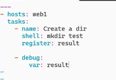

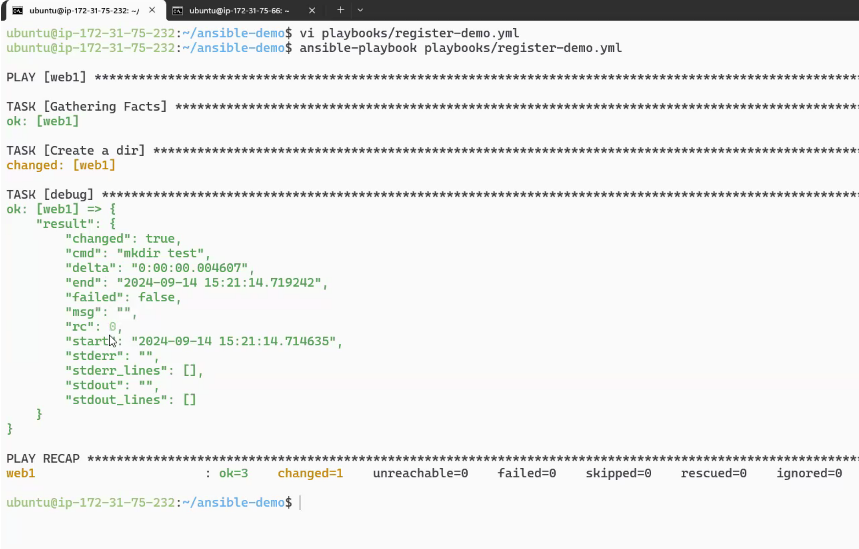

Instead of printing everything we can just print the results that are changed

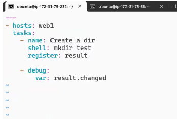

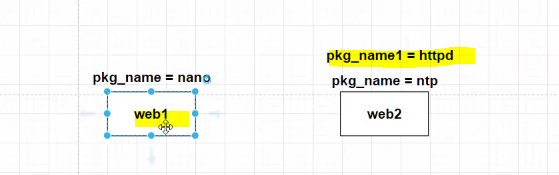

By default Ansible creates an array call hostvars

web1 
pkg_name=nano
web2
pkg_name=ntp
pkg_name1=httpd

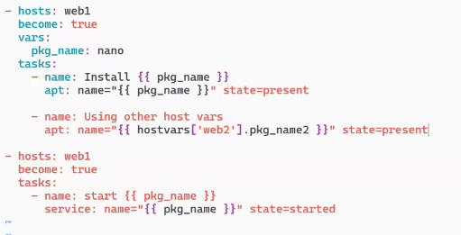

These are called magic variables. All of these available in memory

Can you write a single playbook which installs apcahe on 2 different operating systems?

Yes using conditionals
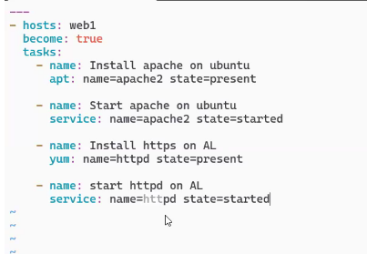

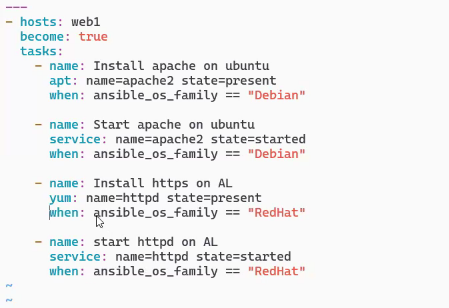

Gathering facts
It creates an execution plan and gathers system information

To optize playbooks you can use blocks

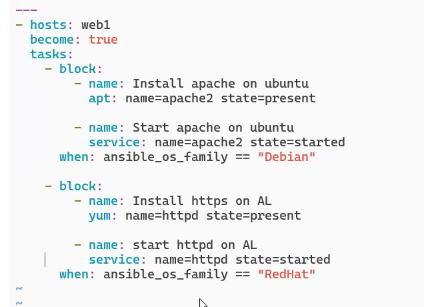

Blocks also help in error handling

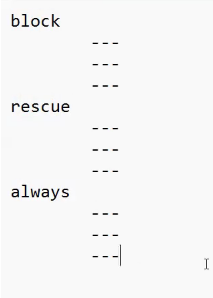

similar to try catch finally

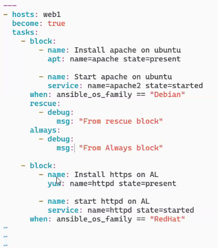

The following is giving name to a block
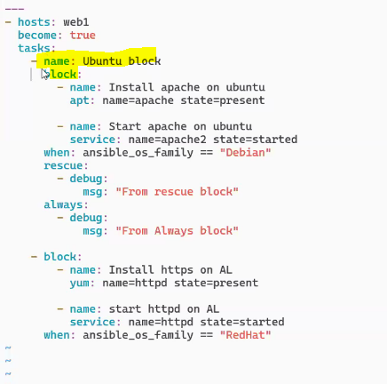

Assignment
Step1: setup the following
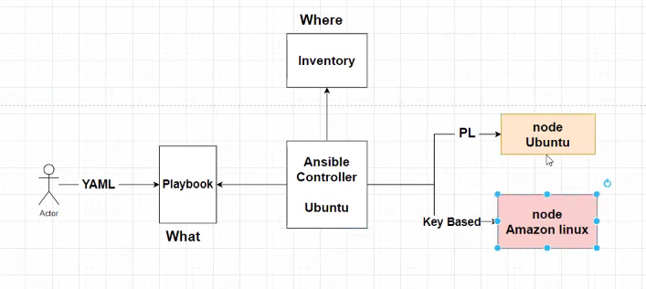

Step2: one universal playbook which should install apache on both the environments and started

Step3: Update the message with the status of the installation on each environment
"Apache insalled and running" or
"Apache is not installed and not running"

Step4: what ever you update in the welcome message shoudl be printed on the console as 

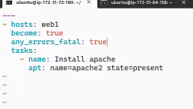

any_errors_fatal: true

Execution of the playbook must be serialized. That means it will for every node to complete each task and then it will continue. If any one node
stops all the other nodes also will stop execution.

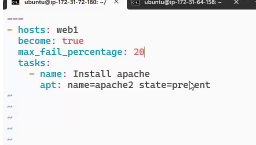

Ansible will continue the playbook executon until the error threshold is reached.

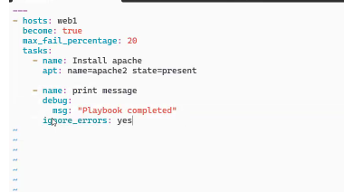

Ignore errors at the task level can be added

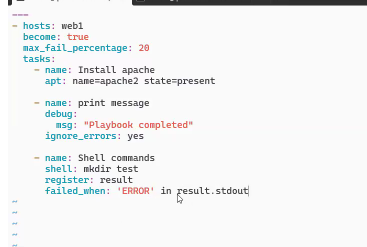

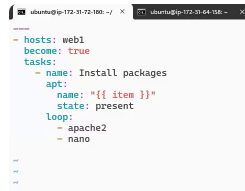

Templating

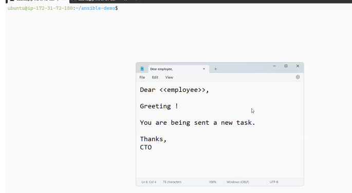

Jinja Templates
This is not part of Ansible and as a tool it has nothing to do with jinja and these templates are used for python.
As Ansbile is using Python we can use it for Python.

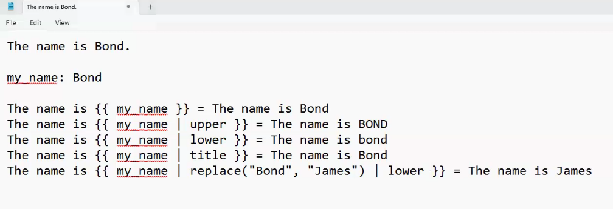

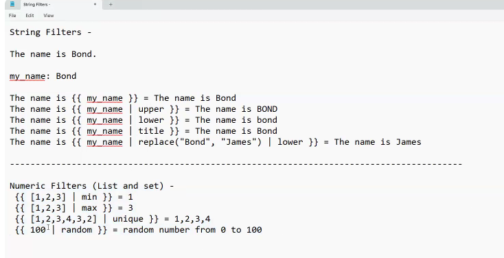

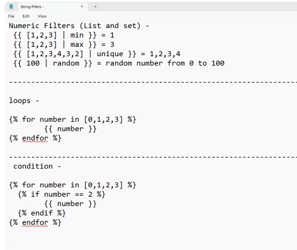

https://jinja.palletsprojects.com/en/3.1.x/changes/

https://jinja.palletsprojects.com/en/2.10.x/templates/  

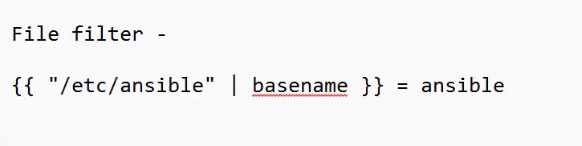

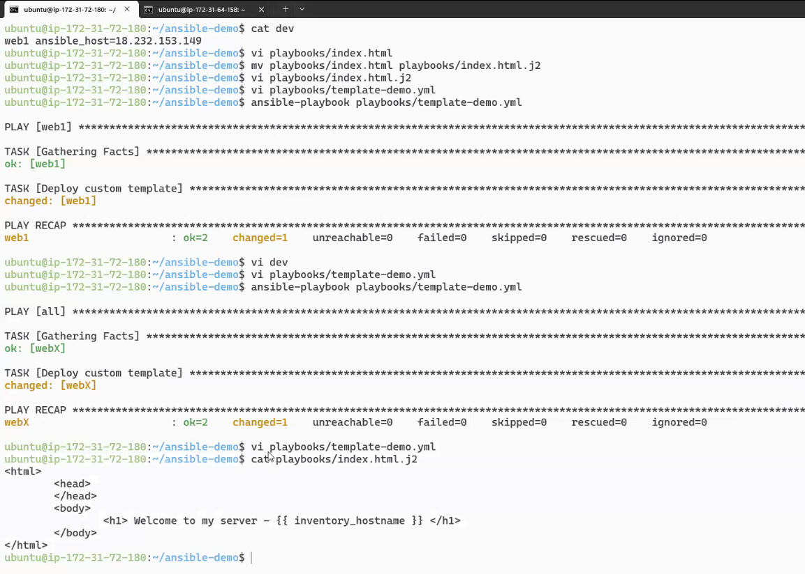

Ansible Roles

Is a predefined directory structure

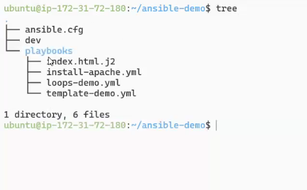

ansible-galaxy init web

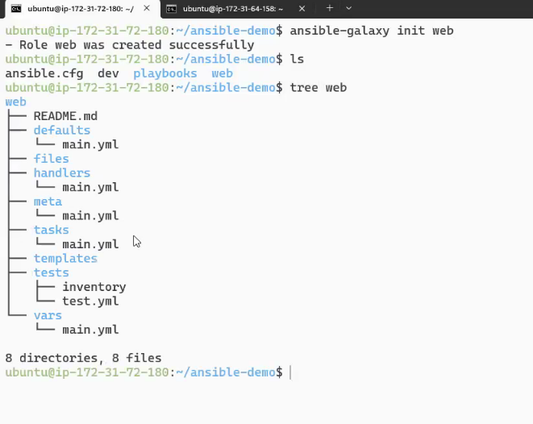

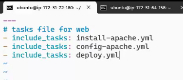

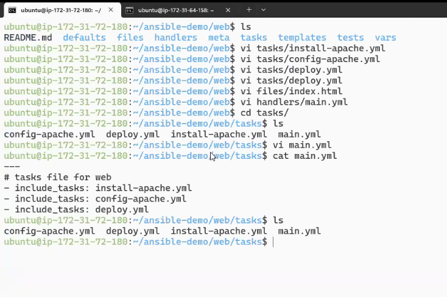

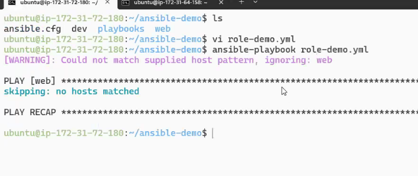

galaxy.ansible.com/ui/standalone/roles/

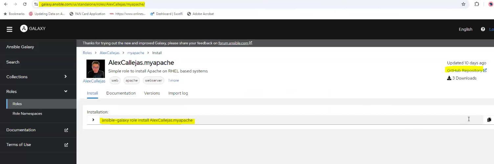

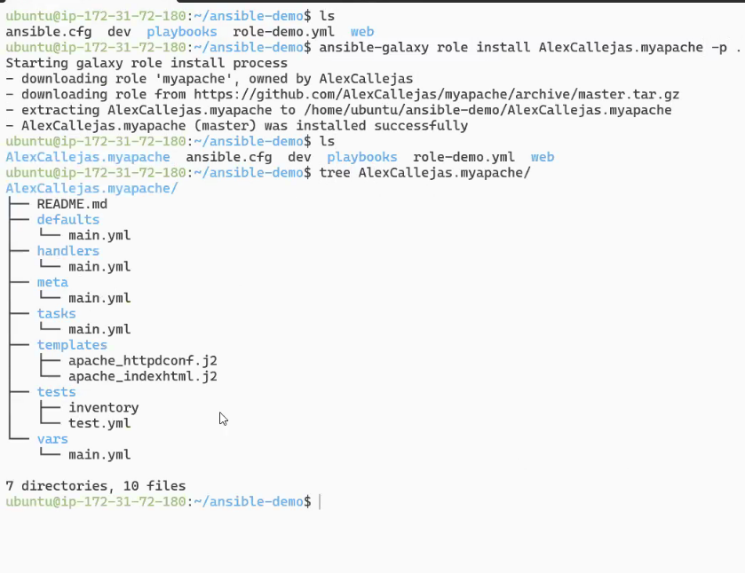

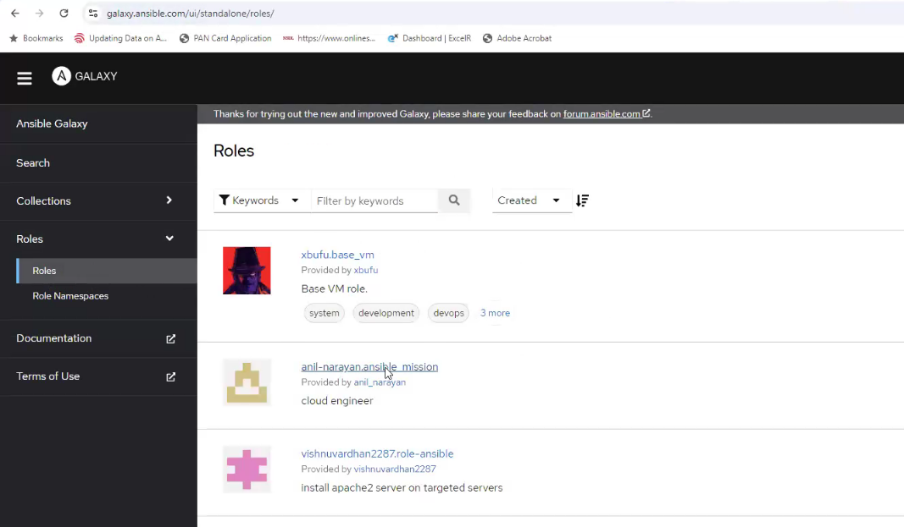

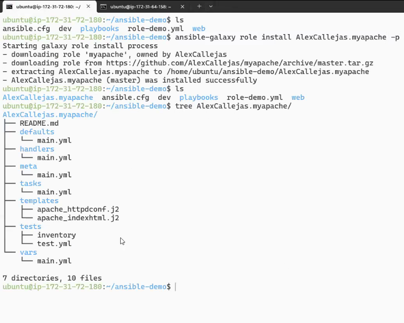

Ansible Galaxy is a repository for finding, sharing, and managing Ansible roles and collections. It's like a central library where developers can access pre-built configurations and automations for their projects. Users can either browse the Galaxy to find reusable roles created by others or upload their own to share with the community. This makes it much easier to streamline tasks, avoid duplicating effort, and collaborate effectively within the Ansible ecosystem. Let me know if you'd like a deeper dive into how it works or its key features!

Ansible Vault is a tool within Ansible designed for securely storing sensitive data, such as passwords, API keys, or other confidential information. It allows you to encrypt your files and variables so that they remain protected while still being usable within your playbooks. You can encrypt, decrypt, edit, or rekey files directly using the `ansible-vault` command-line tool.

This is particularly useful in scenarios where you want to manage secrets securely across your infrastructure without exposing them in plain text. Let me know if you'd like me to elaborate further or share examples of how it works!

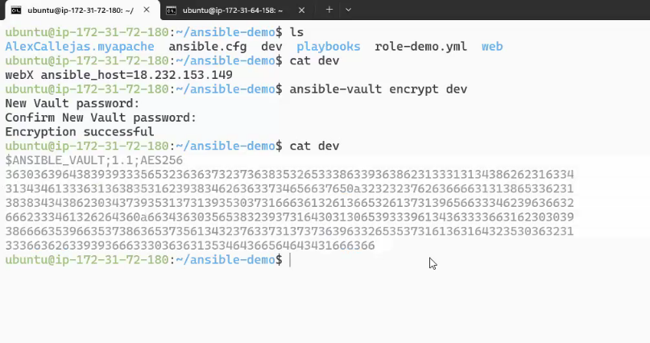

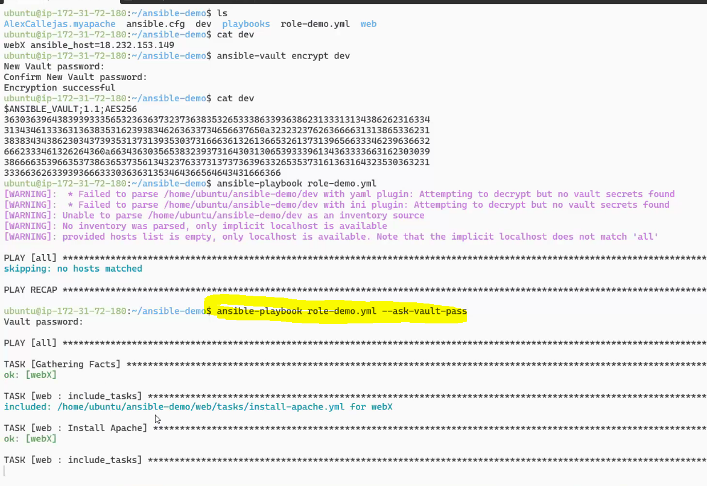

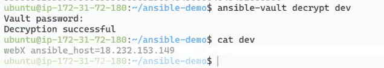

