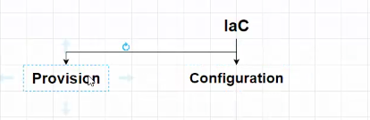
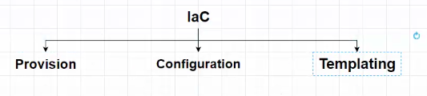
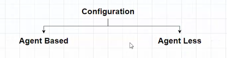
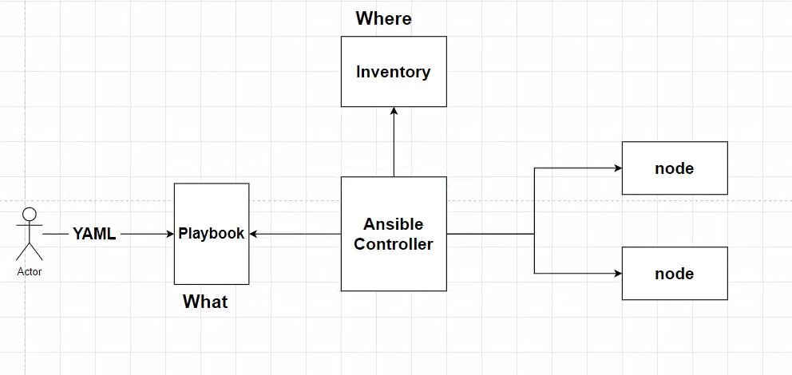

# AnsibleAndTerraform
This repo is created to store Ansible and Terraform artifacts

ssh -i ansibleKey.pem username

Provisioning and configuration in one step is called templating

Ansible vocabulary we call the machines that we handle is called NODE

Where we install Ansible is called "Ansible Controller"

Ansible is developed using Python

All that we need to execute a set of commands

