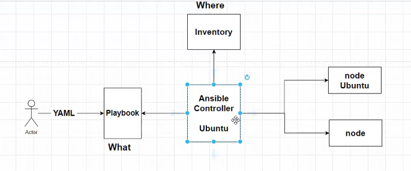
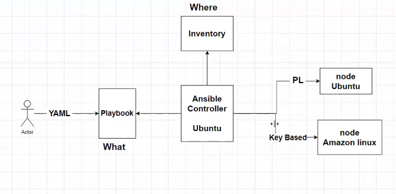

# AnsibleAndTerraform

Provisioning and configuration in one step is called templating

Ansible vocabulary we call the machines that we handle is called NODE

Where we install Ansible is called "Ansible Controller"

Ansible is developed using Python

All that we need to execute a set of commands

https://docs.ansible.com/ansible/latest/installation_guide/installation_distros.html

- $ sudo apt update
- $ sudo apt install software-properties-common
- $ sudo add-apt-repository --yes --update ppa:ansible/ansible
- $ sudo apt install ansible

Ubuntu by defalt has python.

https://docs.ansible.com/ansible/latest/inventory_guide/intro_inventory.html

Assignment

This is the default location of the ansible confioguration file sudo nano /etc/ansible/ansible.cfg

**Ansible Controller**

- ansible --version
- python3 --version (Python is installed by default in ubuntu)
- mkdir ansible-demo
- cd ansible-demo
- sudo nano dev 
- This file contains the inventory information like **IP address, ansible_user,ansible_password,ansible_ssh_private_key_file etc**

- sudo nano key.pem
- chmod 400 key.pem
- sudo ansible -m ping all
- ssh-keygen

- cat /home/ubuntu/.ssh/id_ed25519.pub
- ssh-ed25519 AAAAC3NzaC1lZDI1NTE5AAAAIFR67Wypg/J6Z78fW6By6D2daVTgxR/8ZdOY5dBbltAm ubuntu@ip-172-31-35-124

sudo cat ansible.cfg
[defaults]
inventory = ./dev

**Ansible Node**
- sudo apt update
- python3 --version
- sudo nano .ssh/authorize_keys

**Ansible Controller**
- Now from the dev file removed the remaining parameters and leave the IP address alone and you should be able to connect.
- Connect to the node
- sudo ssh ubuntu@3.19.76.162

